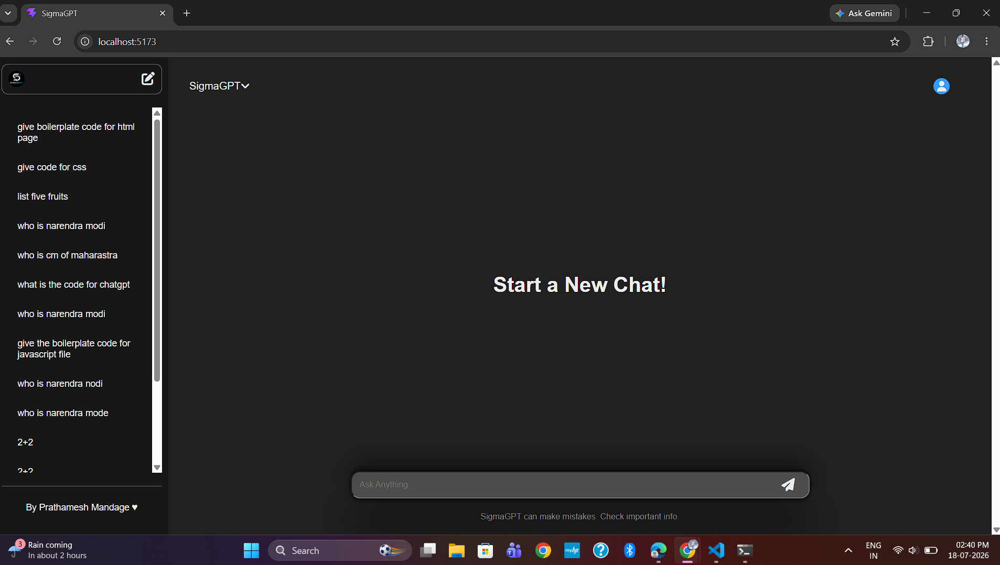
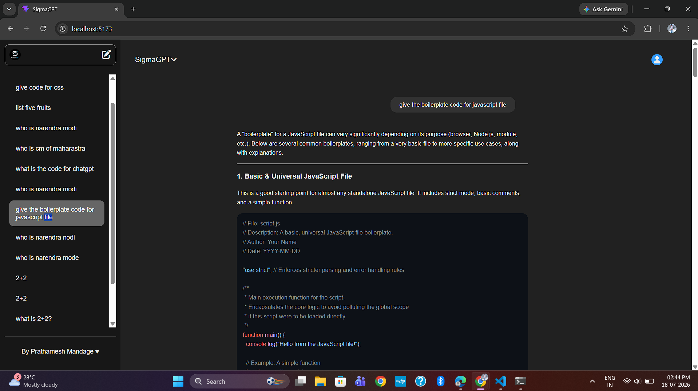
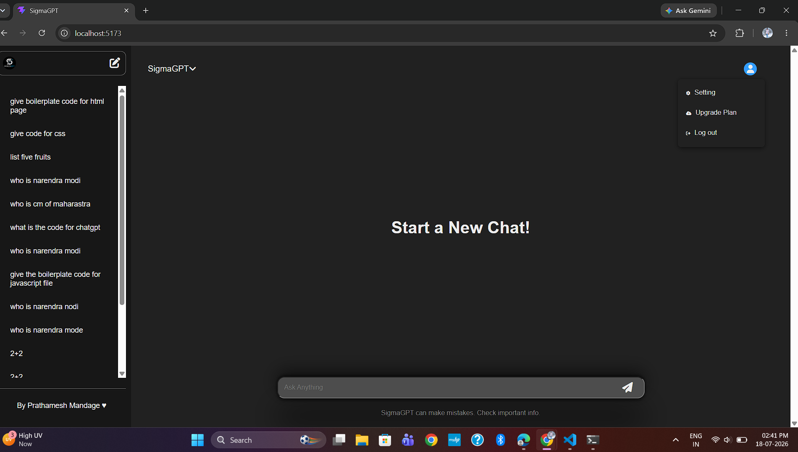

# SigmaGPT 🤖

SigmaGPT is a ChatGPT-inspired AI chatbot built using the MERN Stack.

## Features

- AI Chat
- Multiple Chat Threads
- Gemini API Integration
- MongoDB Database
- React + Vite Frontend
- Express Backend

## Tech Stack

- React
- Node.js
- Express.js
- MongoDB
- Gemini API

## Installation

Backend

```bash
cd Backend
npm install
npm start

# 📸 Screenshots

## 🏠 Home Page



---

## 💬 Chat Interface



---

## ➕ Create New Chat


